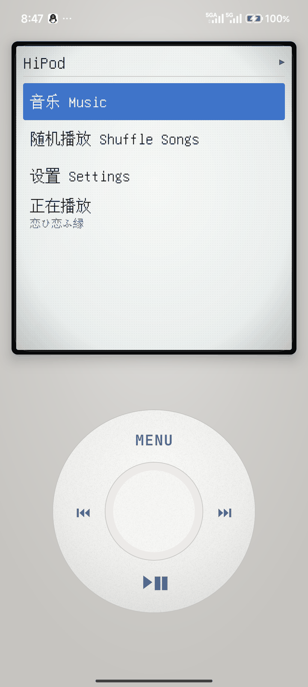
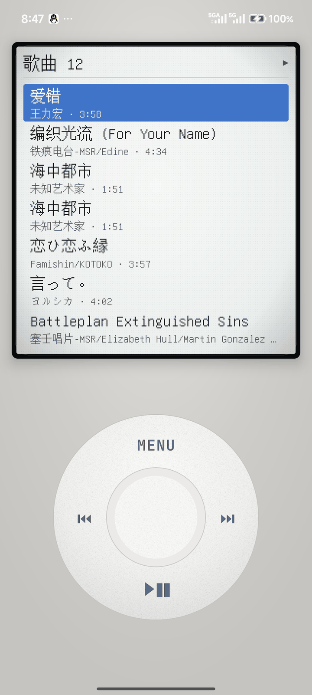
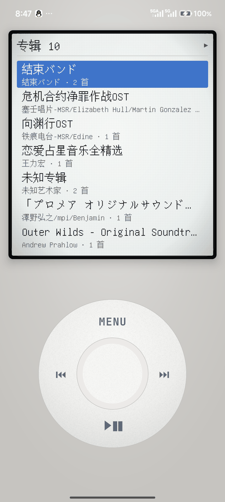
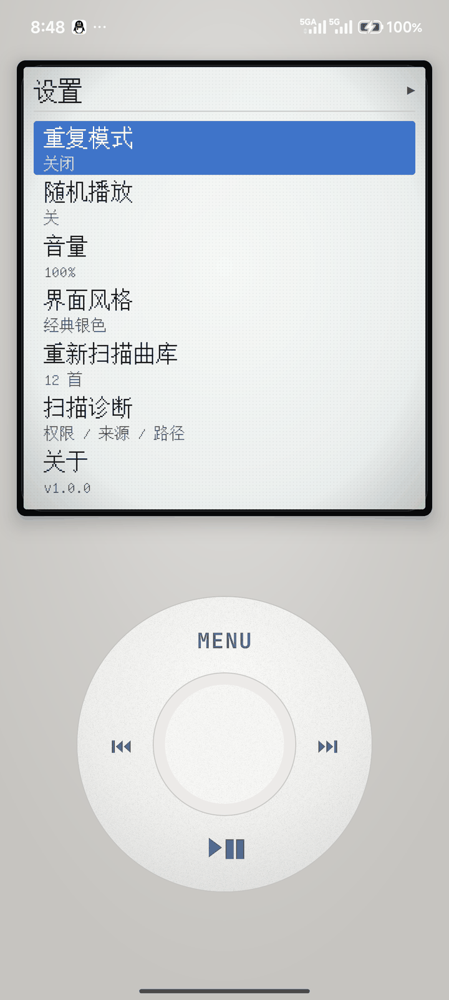
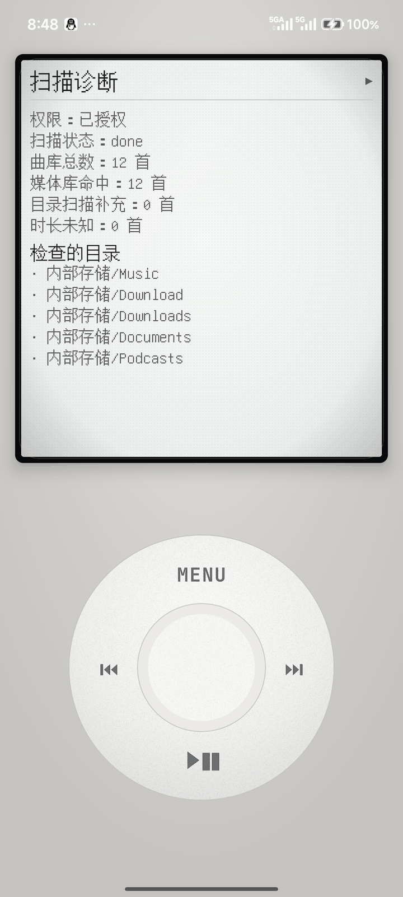
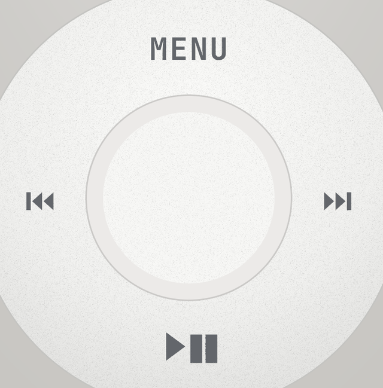
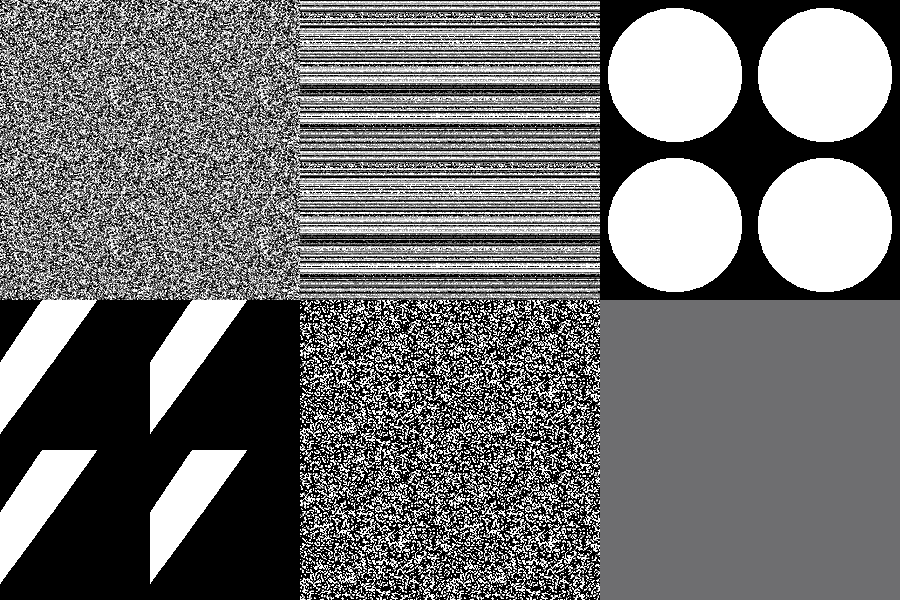
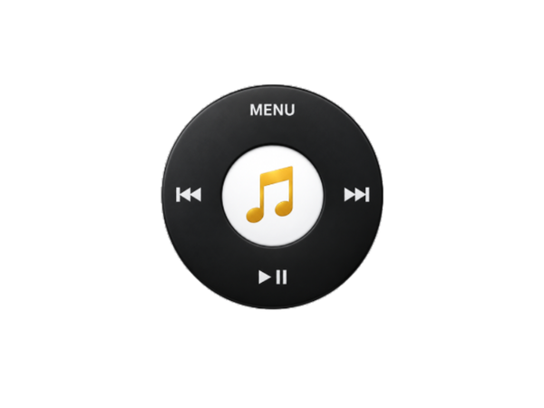

<div align="center">
  
  <h1>HiPod</h1>
  <p><b>复古点击轮音乐播放器</b></p>
  <p>Android 7.0+ ｜ React Native · Expo SDK 57 · TypeScript ｜ 纯本地曲库 · 运行期零网络请求</p>
</div>

---

## 这是什么

一个把 **iPod Classic 的交互**搬进 Android 的本地音乐播放器：转动点击轮选歌、中键确认、MENU 返回层级、▶❚❚ 在任意界面暂停/继续；播放页按中键在「进度 ↔ 音量」之间切换调节对象。

外观走「**工业复刻**」方向：阳极氧化铝机身、哑光硅胶点击轮（颗粒随手指转动）、**黑色电子框**屏幕（外框圆角、内框近直角）、中文像素字体、程序化生成的真实材质贴图。

曲库**完全来自本机**：MediaStore 分页读取 + 文件系统兜底扫描（补齐未被媒体库索引的文件），运行期不发任何网络请求。

<table>
  <tr>
    <td align="center"></td>
    <td align="center"></td>
    <td align="center"></td>
    <td align="center"></td>
  </tr>
  <tr align="center">
    <td>主菜单</td><td>歌曲</td><td>专辑</td><td>设置</td>
  </tr>
</table>

<table>
  <tr>
    <td align="center"></td>
    <td align="center"></td>
    <td align="center"></td>
    <td align="center"></td>
  </tr>
  <tr align="center">
    <td>扫描诊断</td><td>硅胶点击轮特写</td><td>程序化材质贴图</td><td>开屏</td>
  </tr>
</table>

> 截图取自**实际运行的 release 包**（arm64，脱离开发服务器），非设计稿。

## ⚠️ 关于这个项目是怎么做出来的

**代码 100% 由 AI 智能体编写，我没有手写任何一行代码。** 这一点我写在最前面，因为它同时是这个项目最有价值、也最容易被误解的部分。

我的工作集中在人的判断上：

| 我做的 | 具体内容 |
| --- | --- |
| **需求与交互定义** | 点击轮映射（转动/中键/MENU/⏮⏭ 的语义）、两段式音量（先按中键进入调节态、松手退出，避免浏览列表时误触）、层级导航 |
| **技术决策与取舍** | 选 Expo 原生模块而非 Expo Go、双主题零重建架构、材质方向、放弃上架改用固定密钥自签名分发 |
| **真机验收** | 逐轮在真机上验收并描述缺陷：列表首行标题被裁、滚轮惯性手感、边框过宽、圆角过大、MENU 字太细、图标出现方形白边…… |
| **外观方向** | 提供参考图、指定材质与配色、「黑轮盘 + 金色音符」图标设计稿，审核每轮截图 |
| **发布与合规** | 签名密钥管理、权限最小化、字体许可（OFL）、命名规避商标风险 |

AI 负责的是：全部代码实现、脚本工具链、构建排障（Gradle/JDK/依赖冲突）、文档。

**这套协作方式本身就是可迁移的能力**：把模糊需求拆成可验收的改动、用真机数据验证"看起来对不对"、在 AI 给出"应该没问题"时坚持要证据。项目里几条最硬的工程内容（下面第 3、4、6 条）都是在这种"要求证据"的来回里逼出来的。

## 功能一览

- **点击轮交互**：按角度累计每 30° 触发一档，**无惯性**（松手即停）；四方向键 + 中键；▶❚❚ 在**任意界面**都能播放/暂停
- **曲库**：歌曲 / 歌手 / 专辑 / 音乐 四个入口，专辑内按音轨号排序（未知音轨号排最后）
- **播放**：播放/暂停、上一首/下一首、进度与音量调节、随机播放、循环模式、后台播放与锁屏/通知栏控制（MediaSession 前台服务）
- **正在播放**：主菜单底部动态出现「正在播放 + 当前曲名」，曲名过长**跑马灯循环滚动**
- **双主题**：经典银色（仿 iPod Classic）/ 深色背光，设置内切换并持久化
- **扫描诊断**：权限状态、扫描来源统计（媒体库 / 目录补充）、检查过的目录清单，便于定位"为什么扫不到歌"
- **持久化**：设置与播放会话（队列/上次曲目/播放位置/音量）本地保存，重启恢复并停在上次位置

## 工程亮点

**1. 双主题切换零重建**
调色板集中在一个文件（`src/theme/palettes.ts`），组件样式由 `makeThemedStyles` 在模块作用域**预生成两套 StyleSheet**；切换主题只换样式表引用，不重建组件树、不重算样式。

**2. 真实材质：程序化生成的贴图 + 会转的颗粒**
`react-native-svg` 15 在 Android 上**没有实现 `feTurbulence`**（源码直接调用 `warnUnimplementedFilter()`），程序化噪点这条路是死的。于是写了 [scripts/generate-textures.py](scripts/generate-textures.py)，用 Pillow + 固定随机种子生成 5 张**无缝可平铺**贴图（哑光硅胶颗粒 / 铝拉丝 / 柔光高光 / 玻璃反射 / 消色带噪点），全部可复现。
点击轮的颗粒层**随手指转动同步旋转**：手势里直接 `Animated.Value.setValue()`，走原生驱动，不触发 React 重渲染。

**3. 中文像素字体管线**
LCD 用像素字体，但 VT323 只覆盖拉丁——中文会回退到系统字体，像素风当场破功。试过的路都堵着：Google Fonts 没有简体中文像素字体（CSS API 实测 400）、Fontsource 的缝合像素包只带 latin 子集、泛 CJK 包按 unicode-range 拆成 1960 个 woff2（RN 不支持按 unicode-range 回退，也不支持 woff2）。
最终方案：取 npm 上的 **GNU Unifont**（OFL-1.1，全 CJK 点阵）woff2，**自己写 sfnt/cmap 解析**校验码位覆盖（57,087 个），再用 `wawoff2` 转成 TTF 供 RN 使用，脚本化为 [scripts/make-pixel-font.mjs](scripts/make-pixel-font.mjs)。

**4. 无设备也能验证逻辑：断言跑在 Node 上**
`npm run verify` 会把纯逻辑模块（时间格式化、洗牌、专辑/歌手归并、音量钳制）用独立 tsconfig 编译到 `.verify/`，再用 Node 跑断言。它抓到过一个真实缺陷：专辑内排序把"无音轨号"的曲目排到了最前面。

**5. 用像素当证据，而不是"看起来对"**
没有可用的模拟器输入注入（机型限制），于是建立了一套外部验证手段：adb 深链跳转到任意路由 + `uiautomator dump` 读控件树 + **逐帧像素差**判断动画是否真的在动。
两个具体例子：跑马灯是否"滚动→停顿"循环，用相邻帧差异（933 / 0 / 7223 像素）证明；点击轮与屏幕边框的实际宽度，先用轮盘直径反推出屏幕密度（2.977 px/dp），再把测得的像素换算成 dp 核对（实测黑框 6.05dp，与配置的 6dp 一致）。

**6. 让原生改动在 `prebuild` 后不丢失**
`android/` 是 CNG 生成目录（已 gitignore），手写进去的改动会在下次 `prebuild` 被抹掉。为此写了两个 config plugin：
- [plugins/withAndroidBuildFixes.js](plugins/withAndroidBuildFixes.js)：排除重复的 media3 fork 依赖 + 补官方 `media3-inspector`；把 Gradle daemon 的 toolchain 从 25 降到 21（RN 0.86 默认 JDK 25，而 JDK 24+ 限制 `System.load`，会让 CMake 任务失败）；写入本机 JDK 路径避免联网下载
- [plugins/withReleaseSigning.js](plugins/withReleaseSigning.js)：注入固定签名密钥，并让 debug 与 release **共用同一把密钥**（开发包与分享包互相覆盖安装时不必卸载）

**7. 权限最小化**
对外只保留 `READ_MEDIA_AUDIO`、`READ_EXTERNAL_STORAGE`（maxSdk 32）、前台服务与音频相关权限；`RECORD_AUDIO`、`WRITE_EXTERNAL_STORAGE`、`VIBRATE`、`READ_MEDIA_VISUAL_USER_SELECTED` 均显式移除（`tools:node="remove"`），release 包里也不含 `SYSTEM_ALERT_WINDOW`。

**8. 可独立分发的 release 包**
arm64 单架构 51MB，内嵌 JS 字节码 + 12MB 字体 + 贴图，**不需要开发服务器、不需要联网**；用固定密钥签名，已安装用户可直接覆盖升级。

## 技术栈

| 层 | 选型 |
| --- | --- |
| 框架 | Expo SDK 57 · React Native 0.86 · React 19 · TypeScript |
| 路由 | expo-router（`experiments.typedRoutes` 类型化路由） |
| 状态 | Zustand（播放器 / 设置两个 store）+ AsyncStorage 持久化 |
| 音频 | expo-audio（后台播放 + MediaSession 锁屏控制） |
| 曲库 | expo-media-library（MediaStore 分页）+ 自写文件系统兜底扫描 + `@missingcore/react-native-metadata-retriever` 读标签与封面 |
| 视觉 | react-native-svg（渐变/点阵/暗角）· react-native-gesture-handler（转盘手势）· 自生成位图贴图 |
| 字体 | GNU Unifont（中文像素，OFL-1.1）· JetBrains Mono（按键刻印） |
| 工具链 | 两个自写 config plugin · Pillow 脚本（贴图/图标）· Node 脚本（字体）· Node 断言 |

## 项目结构

```
src/
├─ app/                # expo-router 路由：主菜单/音乐/歌曲/歌手/专辑/正在播放/设置/扫描诊断
├─ components/ipod/    # 外观层：外壳、LCD、菜单列表、点击轮、材质图层、跑马灯
├─ components/player/  # 播放器 Provider
├─ store/              # Zustand：播放器状态、设置
├─ services/           # 扫描（MediaStore + 文件系统）、封面解析、持久化、曲库索引
├─ hooks/              # useWheelNav / useTheme / usePlaybackToggle / usePersistence …
├─ theme/              # 双主题调色板、主题化样式、字体常量
└─ utils/              # 时间格式化、洗牌、音量钳制
assets/
├─ fonts/              # Unifont（OFL 许可证随附）
├─ textures/           # 程序化生成的 5 张无缝贴图
├─ brand/              # 图标设计稿原图
└─ images/             # 图标 / 自适应图标 / 开屏
scripts/               # 贴图与图标生成、字体转换、逻辑断言
plugins/               # 两个 Android config plugin
docs/screenshots/      # README 截图
```

## 快速开始

```bash
npm install

# 需要原生模块（metadata-retriever / expo-audio 等），必须用开发构建，不能用 Expo Go
npx expo prebuild -p android
npx expo run:android          # 或先在 Android Studio 打开 android/ 后运行

# 纯逻辑断言（不需要设备）
npm run verify

# 重新生成素材（可选）
python scripts/generate-textures.py       # 材质贴图
python scripts/prepare-app-icon.py        # 图标与开屏
node   scripts/make-pixel-font.mjs        # 中文像素字体（woff2 → TTF）
```

出包与分享、签名密钥、常见问题等细节见下方章节。

## 已知限制

- 只支持 Android（未做 iOS 适配）；最低 Android 7.0
- 12MB 像素字体使包体偏大（可换更小的开源像素字体或做子集）
- release 包未上架应用商店，属自签名分发（安装时需允许"未知来源"）
- 尚未实现：播放列表编辑、Genres 分类、歌词、EQ
- UI 细节仍在打磨（材质参数、网格密度等）

## 许可与致谢

- **字体**：GNU Unifont，SIL OFL-1.1，许可证见 [assets/fonts/LICENSE-Unifont.txt](assets/fonts/LICENSE-Unifont.txt)
- **本项目与 Apple 无关**：`iPod`、点击轮造型均为 Apple 的商标/设计标识，本项目仅作个人学习与技术演示，应用对外名称为 **HiPod**，不使用任何 Apple 素材
- 代码由 AI 智能体生成；如需开源许可（如 MIT）可自行添加

---

# 详细技术文档

以下章节是项目的深度参考：外观规范、材质与字体实现、原生构建修补、打包发布与排障记录。

## 界面风格（双主题）

设置 → **界面风格** 可切换两种风格，选择会持久化：

| 风格 | 说明 |
| --- | --- |
| **经典银色**（默认） | 仿 iPod Classic：银色机身 + 纯白点击轮 + 白底列表（选中为蓝底白字） |
| 深色背光 | 初版风格：黑色金属机身 + 蓝色背光 LCD + 白色扫描线纹理 |

实现要点：

- 调色板集中在 [src/theme/palettes.ts](src/theme/palettes.ts)，组件样式用 `makeThemedStyles`
  预生成两套（[src/theme/themedStyles.ts](src/theme/themedStyles.ts)），切主题只换样式表、不重建组件树

## 材质系统（工业复刻方向）

设计方向：**阳极氧化铝机身 + 哑光硅胶操作件 + 纯黑电子框屏幕 + 早期 TN 屏观感**。

| 部位 | 做法 |
| --- | --- |
| 屏幕边框 | 外层**黑电子框**（外框圆角 18、宽度 5px、内唇高光），屏面**内框近直角**（radius 3） |
| 复古屏 | TN 冷绿偏色 → 像素栅格 → 暗角 → 玻璃反射 → 细微噪点，字体用 VT323 |
| 机身 | 阳极氧化铝竖向渐变 + 拉丝贴图 + 上下倒角高光/阴影 + 噪点；机身内凹槽让电子框嵌进金属 |
| 点击轮 | 哑光硅胶：环面颗粒贴图**随手指转动同步旋转**；中键为凸起硅胶按键；图标微凹刻印 |

材质贴图由 [scripts/generate-textures.py](scripts/generate-textures.py) **程序化生成**（Pillow，固定随机种子，可复现）：

```bash
python scripts/generate-textures.py    # 输出到 assets/textures/
```

> ⚠️ 为什么不直接写 SVG 噪点：`react-native-svg` 15 在 Android 上**未实现 `feTurbulence`**
> （源码里直接调用 `warnUnimplementedFilter()`），程序化颗粒/拉丝只能用可平铺位图实现。

## 字体（中文像素字体）

LCD 文本统一使用 **GNU Unifont**（`assets/fonts/unifont-pixel.ttf`，OFL-1.1）：

- 它是少数**同时具备像素观感与完整中日韩覆盖**的字体（cmap 5.7 万码位），
  中文不会回退到系统字体 —— 一旦回退，像素风立刻被破坏
- 12MB（Unifont 把点阵存成轮廓，体积偏大）；如需瘦身可用 `pyftsubset` 做子集，
  或直接换成更精致的 Fusion Pixel / Zpix（见下）

重新生成：

```bash
npm i --no-save --cache .npm-cache @fontsource/unifont wawoff2
node scripts/make-pixel-font.mjs      # woff2 → TTF（RN 不支持 woff2）
```

**换成别的手写像素字体**（例如 [Fusion Pixel 缝合像素字体](https://github.com/TakWolf/fusion-pixel-font)、
[Zpix 最像素](https://github.com/SolidZORO/zpix-pixel-font)）：把单个 `.ttf` 放进
`assets/fonts/`，然后改两处 —— `src/app/_layout.tsx` 的 `useFonts` 键名、以及
`src/theme/fonts.ts` 里的 `lcd`（想只让拉丁用 VT323 就把它换回 `lcdLatin`）。

> 为什么不用 VT323 直接显示中文：VT323 只覆盖拉丁，中文会掉到系统字体；
> Google Fonts 也没有简体中文像素字体（实测 CSS API 返回 400），
> 而 Fontsource 的 Fusion Pixel 包只带 latin 子集、泛 CJK 包是按 unicode-range
> 拆分的 woff2（RN 无法按 unicode-range 回退）。

## 图标与开屏

设计稿：**3D 黑点击轮 + 白色中键 + 金色音符**，原图放在
[assets/brand/icon-source.png](assets/brand/icon-source.png)（1254×1254）。
派生脚本 [scripts/prepare-app-icon.py](scripts/prepare-app-icon.py) 生成 `assets/images/` 下全部素材：

| 文件 | 用途 |
| --- | --- |
| `icon.png` | 应用图标（沿用设计稿的白色底与投影） |
| `android-icon-foreground.png` | 自适应图标前景：**抠掉外层白底**后缩到安全区内 |
| `android-icon-background.png` | 自适应图标背景（近白微渐变） |
| `android-icon-monochrome.png` | 单色图标（轮盘剪影 + 音符挖空，由系统着色） |
| `splash-icon.png` | 开屏图标，配合 `app.json` 里 `expo-splash-screen` 的 `backgroundColor: #FFFFFF` |
| `favicon.png` | Web 图标 |

重新生成与生效：

```bash
python scripts/prepare-app-icon.py        # 换设计：替换 assets/brand/icon-source.png 即可
npx expo prebuild -p android              # 图标/开屏是原生资源，必须重新 prebuild + 构建
cd android && ./gradlew :app:assembleDebug
```

> ⚠️ 抠图**不能按亮度去白**：中键、MENU/箭头、音符都是白色，按亮度去白会把它们一起抠掉。
> 脚本用 flood fill 只清除**从画布边缘连通**的白色区域。
>
> ⚠️ 图标与开屏属于原生资源，改完**必须重新构建 APK**才会在桌面/启动时可见；
> 只改 JS 是看不到效果的。**构建前先停掉 Metro**（见「常见问题」）。

## 点击轮操作映射

| 操作 | 作用 |
| --- | --- |
| 转动滚轮 | 菜单/列表选中移动；正在播放页调进度或音量。**无惯性**，手指离开即停 |
| 中键 | 确认进入；**正在播放页循环切换「进度 ↔ 音量」显示模式**；**设置页进入音量调节态** |
| MENU | 返回上一级；在「关于」页内先退回设置列表 |
| ⏮ / ⏭ | 上一首 / 下一首 |
| ▶❚❚ | 播放 / 暂停。**任一界面都可用**（有曲目在播时），由 `usePlaybackToggle` 统一处理 |

> 主菜单底部在**有曲目时**会多出一行「正在播放 + 当前曲名」（中键进入正在播放界面）；
> 曲名过长时该行做跑马灯循环滚动（[MarqueeText.tsx](src/components/ipod/MarqueeText.tsx)）。

> 设置页的音量是「两段式」：先按中键进入调节态，此时转动滚轮才改音量；
> **滚轮一松手就自动退出调节态**，要再调需重新按中键——避免浏览列表时误触改音量。

## 布局约定

所有页面共用 `IpodShell`，因此版式完全一致：

- LCD 机身固定占**上半屏**（底边落在屏幕中线附近），尺寸不随内容多少变化，
  长列表在 LCD 内部滚动，不会把机身撑高
- 点击轮在下半屏**垂直居中**，其与 LCD 的间距和与屏幕底边的间距相等（屏幕中下位置）
- 因此换页时点击轮坐标不会漂移

## 开发里程碑与演进

功能里程碑：

- **M1 骨架** ✅ Expo 工程 + 路由 + 字体/主题 + 点击轮
- **M2 扫描** ✅ 权限 + MediaStore 分页 + 标签读取 + 惰性封面 + **文件系统兜底扫描**
- **M3 播放** ✅ 播放/暂停/切歌/进度/音量 + 后台播放 + 锁屏与通知栏控制（MediaSession 前台服务）
- **M4 界面** ✅ LCD 背光 + 金属机身渐变 + 蓝光晕 + 轮盘渐变 + 进度菱形播放头
- **M5 打磨** ✅ 菜单反色选中 + 随机 + 循环 + 设置页 + 状态持久化 + 播放进度恢复
- **M6（未做）** ⬜ 播放列表编辑、风格 Genres

交付后的几轮迭代（按验收反馈推进，记录在此以体现演进过程）：

| 轮次 | 内容 |
| --- | --- |
| 交互修正 | 固定 LCD 尺寸与轮盘位置（各界面版式一致）· 音量改两段式 · **移除滚轮惯性** · 修复列表首行标题被裁 |
| 双主题 | 从单主题重构为调色板 + 预生成样式表；新增「经典银色」 |
| 材质重构 | 黑电子框（外圆角/内直角）· 阳极氧化铝拉丝 · 哑光硅胶点击轮（颗粒随转动）· 复古点阵屏（3dp 点阵 + 节奏吸附） |
| 交互补充 | 主菜单「正在播放」条目（跑马灯）· ▶❚❚ 全局生效 |
| 字体 | 中文像素字体（Unifont）替换系统字体回退 |
| 品牌与发布 | 新图标/开屏（3D 轮盘 + 金色音符）· 更名 **HiPod** · 固定密钥签名 + arm64 release 自签名分发 |


## 曲库扫描说明

扫描为**双来源合并**（`src/services/scanner.ts`）：

1. **MediaStore**（`expo-media-library`）：正常被系统索引的音频，可直接拿到时长。
2. **文件系统兜底**（`src/services/filesystemScan.ts`）：遍历 `Music` / `Download` / `Documents` 等目录，
   发现**未被媒体索引**的音频文件（典型场景：`adb push` 或文件管理器拖入的文件，不会自动进媒体库）。
   这类曲目拿不到时长，列表显示 `—`，播放时由 native 播放器回填真实时长。

若扫描结果为 0 首，可先确认文件是否已被系统索引：

```bash
adb shell content query --uri content://media/external/audio/media --projection _id,_display_name

# 手动触发媒体扫描
adb shell content call --method scan_volume --uri content://media --arg external_primary
```

或直接把音频文件放进设备 `Music/` 目录。设置页 → 关于 会显示「媒体库 N 首 · 目录 M 首」用于定位问题。

## ⚠️ 原生工程（`android/`）与自动修补

`android/` 是 Expo CNG 生成的目录，**已被 .gitignore 忽略**，`npx expo prebuild --clean` 会整目录重新生成。
本项目依赖的 3 处原生侧改动已由 **[plugins/withAndroidBuildFixes.js](plugins/withAndroidBuildFixes.js)** 在 prebuild 时自动应用，
因此「全新克隆 → `npx expo prebuild` → `npx expo run:android`」可直接构建，无需手工改文件。

| # | 位置 | 插件做的事 | 原因 |
| --- | --- | --- | --- |
| 1 | `android/app/build.gradle` | 注入 `configurations.configureEach { exclude group: "com.github.MissingCore.media" }` 与官方 `media3-inspector` 依赖 | metadata-retriever 带入的 MissingCore fork media3 与 expo-audio 的官方 androidx.media3 类重复（duplicate class） |
| 2 | `android/gradle/gradle-daemon-jvm.properties` | `toolchainVersion` 由 25 改为 **21** | RN 0.86 默认要 daemon 跑 JDK 25，而 JDK 24+/25 限制 `System.load`（[gradle/gradle#31625](https://github.com/gradle/gradle/issues/31625)），会让 worklets/screens 的 `configureCMakeDebug` 失败 |
| 3 | `android/gradle.properties` | 写入 `org.gradle.java.home` 与 `org.gradle.java.installations.paths` | 让 Gradle 用本机 JDK，避免联网下载 JDK 25（国内网络易失败） |

插件读取的环境变量：

- `JAVA_HOME`：作为 `org.gradle.java.home`（requirement 2 要求它是 **JDK 21**）
- `ANDROID_STUDIO_JBR`（可选）：Android Studio 自带 JBR 路径，一并加入 Gradle 的 toolchain 搜索路径

验证方式（不会改动你正在用的 `android/`）：把工程复制一份、`node_modules` 用目录联接指向原目录，在副本里执行
`npx expo prebuild --platform android --no-install`，确认上述 3 处已生成、且 `gradlew --version` 显示
`Daemon JVM: Compatible with Java 21`。

## 数据与持久化

- 设置（重复模式 / 随机）与播放会话（队列 / 上次曲目 / 播放位置 / 音量）通过 AsyncStorage 持久化，
  下次启动恢复并停在上次位置（不自动播放）。
- 封面惰性解析后落盘为 `file://` 路径，**不存 base64**。

## 打包与分享（不上架）

应用名 **HiPod**，包名 `com.arleta.ipodplayer`，最低 Android 7.0（minSdk 24）。

### 固定签名密钥

分享用的包必须用**固定密钥**签名，否则以后 `android/` 重建（debug keystore 重新生成）
会导致别人装不上新包、必须先卸载。

- 密钥：`keys/hipod-release.jks`（已 gitignore，**务必另行备份**）
- 口令：`keys/keystore.properties`（同样已 gitignore）
- 注入方式：[plugins/withReleaseSigning.js](plugins/withReleaseSigning.js) 在 prebuild 时写入
  `signingConfigs.release`，并让 **debug 与 release 共用同一密钥** —— 这样开发包与分享包
  之间来回安装不需要先卸载
- 也可用环境变量覆盖：`HIPOD_KEYSTORE` / `HIPOD_KEYSTORE_PASSWORD` / `HIPOD_KEY_ALIAS` / `HIPOD_KEY_PASSWORD`

丢失密钥的后果：已安装该包的人**无法覆盖更新，只能卸载重装**。

### 出包

```bash
npx expo prebuild -p android
cd android && ./gradlew :app:assembleRelease -PreactNativeArchitectures=arm64-v8a
# → app/build/outputs/apk/release/app-release.apk
```

- `-PreactNativeArchitectures=arm64-v8a` 只打 arm64（现代手机都是），包体约 50MB；
  省略则打全部四种架构（约 60~100MB）
- release 包**内嵌 JS bundle（Hermes 字节码）、字体与贴图**，不需要 Metro、不需要联网
- 每次对外发新版请递增 `app.json` 里的 `android.versionCode`

### 别人安装时

1. 允许「安装未知应用」；Google Play 保护机制可能提示「未经扫描」→ 选**仍要安装**
2. 小米/HyperOS 还需开启「USB 安装」或给文件管理器安装权限
3. 首次打开会申请**读取音频文件**权限，授权后扫描本机音乐（手机里得有音乐）

## 常见问题

**改完原生资源（图标 / 开屏 / prebuild）后应用一直卡在开屏**

`npx expo prebuild` 会**删除并重建 `android/`**，正在运行的 Metro 文件监听会因此失效：
此后字体、贴图等静态资源会返回 404，**且响应要等 30~40 秒**，应用就会长时间停在开屏
（`useFonts` 一直不 resolve）。**重启 Metro 即可恢复** —— 这也意味着做原生改动时应先停 Metro。

排查手段：直接向 Metro 要一次资源，确认是 200 且很快（注意路径里 `assets/` 会出现两次，
因为它是项目根下的相对路径）：

```bash
# 8081 换成你当前 Metro 的端口；hash 用文件的 md5
curl -s -o NUL -w "%{http_code} %{time_total}s\n" \
  "http://localhost:8081/assets/assets/fonts/unifont-pixel.ttf?platform=android&hash=<md5>"
```

